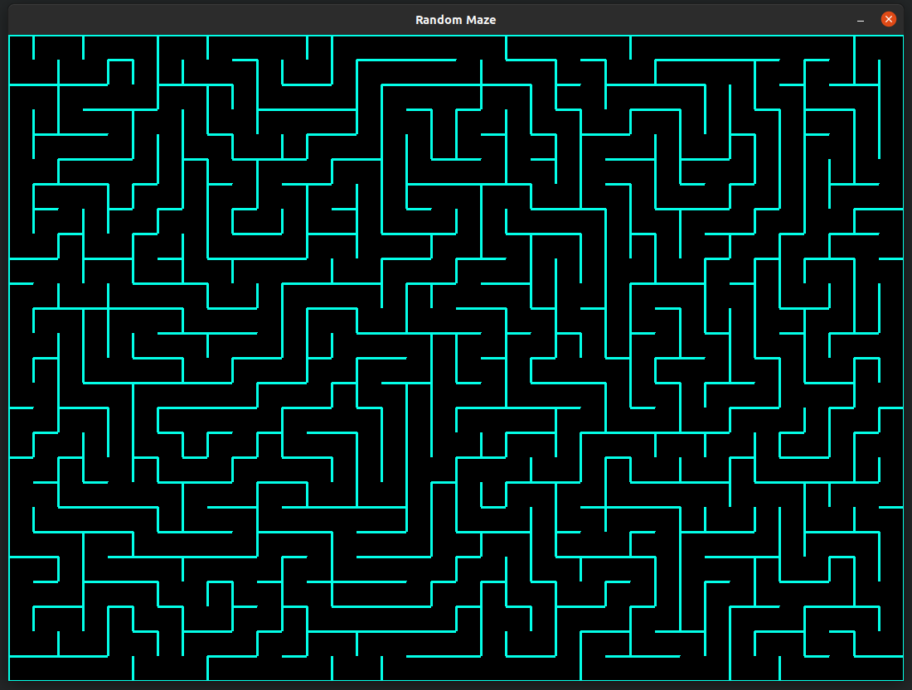
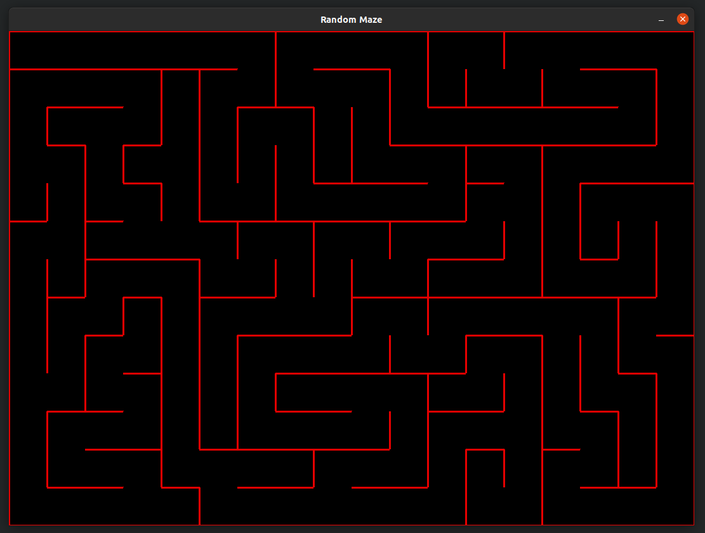
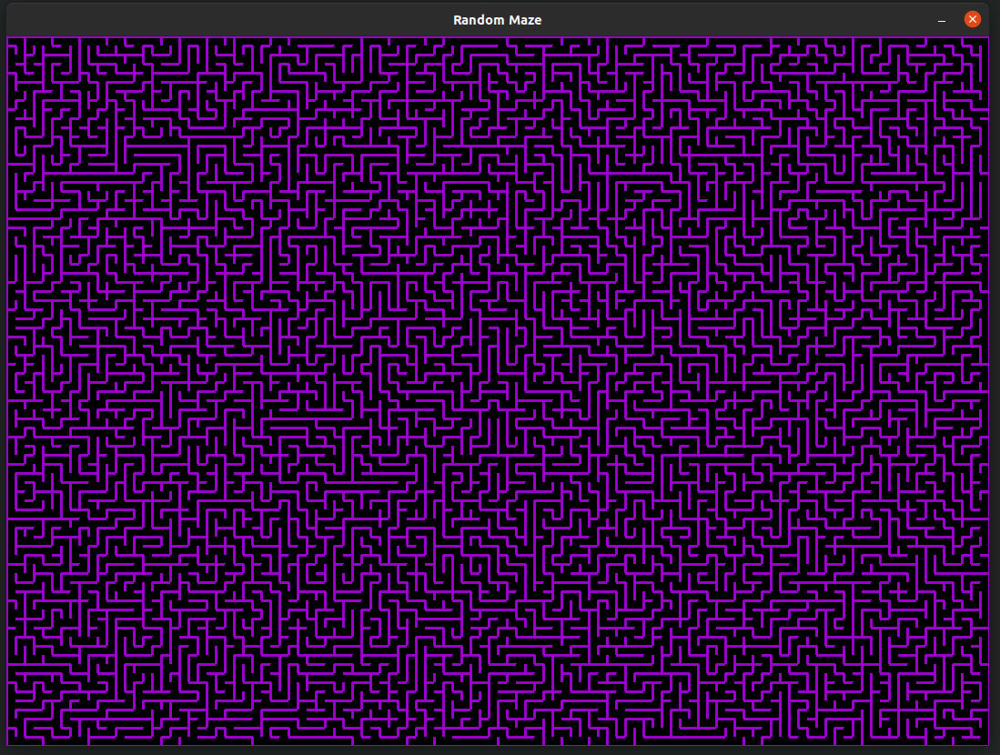

# Random maze generator
A random maze generator written in python that utilizes pygame for visuals.

## Variety of random mazes

## Running the Program
Users can run the game by typing ``python3 main.py`` in the terminal. Pygame installation required.

## Features
* Generates a different maze each time the program is ran.
* Maze size can vary depending on the screen resolution, and line length variables.
* Screen width, height, and line length can be changed by changing the ``SCREEN_WIDTH``, ``SCREEN_HEIGHT``, and ``LENGTH`` variables respectively.
* Maze color can be changed by changing the ``LINE_COLOR`` and ``V_COLOR`` variables.

